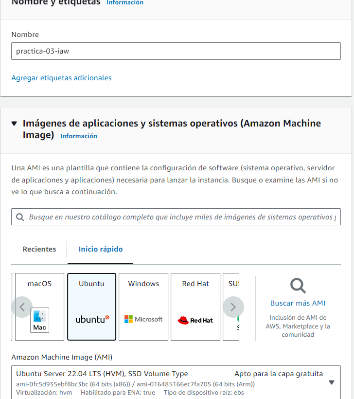
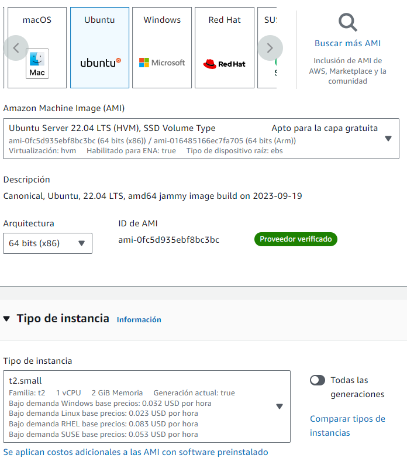
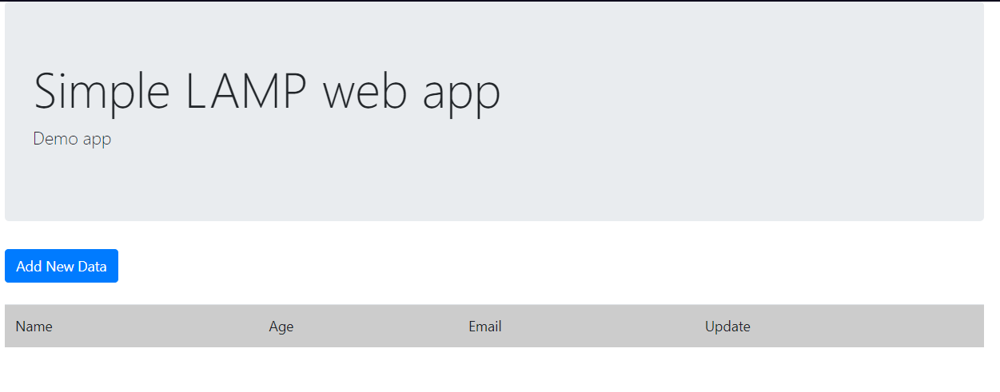
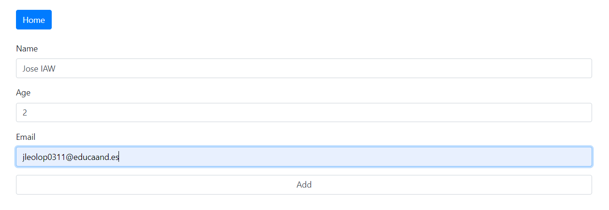

# Practica-03-IAW
### Para esta práctica vamos a crear una instancia de ubuntu, pulsamos en lanzar instancia y seleccionamos ubuntu 

### Le ponemos de tamaño small la máquina.

### Le permitimos el tráfico http y https para que nos añada los puertos de seguridad directamente 

### Después de esto le asignamos una ip pública o ip elástica y empezamos con los scripts.

### Tenemos tres scripts que vamos a copiar de la práctica uno: es script del install_lamp, el de configuracion y el de php.

### El script del lamp es este paso por paso :

#### Muestra todos los comandos que se van ejecutando
~~~
set -x
~~~
#### Actualizamos los repositorios
~~~
apt update
~~~
#### Actualizamos los paquetes
~~~
#### apt upgrade -y
~~~
#### instalamos el servidor web Apache
~~~
apt install apache2 -y
~~~
#### Instalamos e sistema gestor de base de datos de mysql
~~~
apt install mysql-server -y
~~~
#### mysql -u $DB_USER -p $DP_PASSWD < .../sql/database.sql

#### Instalamos  PHP
~~~
apt install php libapache2-mod-php php-mysql -y
~~~
#### Copiar el archivo de configuración de Apache 
~~~
cp ../conf/000-default.conf /etc/apache2/sites-available
~~~
#### Reiniciamos el servicio Apache
~~~
systemctl restart apache2
~~~
#### Copiamos el archivo de prueba de php
~~~
cp ../php/index.php /var/www/html
~~~
#### Modificamos el propietario y el grupo del directorio /var/www/html
~~~
chown -R www-data:www-data /var/www/html
~~~
### El archivo de cofiguracion 000-default-conf es este:
~~~
ServerSignature Off
ServerTokens Prod

<VirtualHost *:80>
#ServerName www.example.com
DocumentRoot /var/www/html

  DirectoryIndex index.php index.html

  ErrorLog ${APACHE_LOG_DIR}/error.log
  CustomLog ${APACHE_LOG_DIR}/access.log combined
</VirtualHost>
~~~
### El archivo de php
~~~
<?php

phpinfo();

?>
~~~
### Después tenemos nuestro archivo .env para guardar nuestras variables
~~~
# Configuramos las variables
#-------------------------------------------
DB_NAME=aplicacion
DB_USER=usuario
DB_PASSWORD=password
~~~
### Y el ultimo es el script del deploy.sh que paso por paso hace esto:

#### Muestra todos los comandos que se van ejecutando  
~~~
set -x
~~~
#### Importamos las variables 
~~~
source .env 
~~~
#### Actualizamos los repositorios 
~~~
apt  update 
~~~
#### Actualizamos todos los paquetes 
~~~
#apt upgrade -y 
~~~
#### Eliminamos descargas previas del repositorio 
~~~
rm -rf /tmp/iaw-practica-lamp
~~~
#### Clonamos el repositorio con el codigo fuente de la aplicacion
~~~
git clone https://github.com/josejuansanchez/iaw-practica-lamp /tmp/iaw-practica-lamp
~~~
#### Movemos el codigo fuente de la aplicaciona /var/www/html
~~~
mv /tmp/iaw-practica-lamp/src/* /var/www/html
~~~
#### Configuramos el archivo sql para que no de error al poner una base de datos distinata a lamp_db
~~~
sed -i "s/lamp_db/$DB_NAME/g" /tmp/iaw-practica-lamp/db/database.sql
~~~
#### Configuramos el archivo config.php de la aplicación
~~~
sed -i "s/database_name_here/$DB_NAME/" /var/www/html/config.php
sed -i "s/username_here/$DB_USER/" /var/www/html/config.php
sed -i "s/password_here/$DB_PASSWORD/" /var/www/html/config.php
~~~
#### Importamos el script de base de datos 
~~~
mysql -u root < /tmp/iaw-practica-lamp/db/database.sql
~~~
#### Creamos el usuariob de la base de datos y le asignamos privilegios
~~~
mysql -u root <<< "DROP USER IF EXISTS $DB_USER@'%'"
mysql -u root <<< "CREATE USER $DB_USER@'%' IDENTIFIED BY '$DB_PASSWORD'"
mysql -u root <<< "GRANT ALL PRIVILEGES ON $DB_NAME.* TO $DB_USER@'%'"
~~~
#### Y al ejecutar el script y menternos en el navegador en la ip elástica nos saldría la aplicación en la que podemos meter las bases de datos que queramos.
#### Así se vería la página web

#### Añadimos una base de datos 

#### Y nos saldría en la página.

